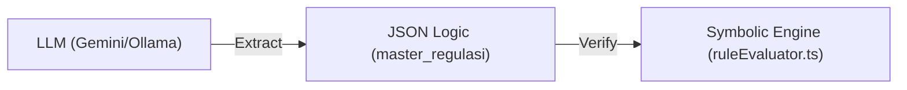

# 🤖 SIP-DADES Operator Skill

Skill ini memandu AI Agent dalam mengelola, mengembangkan, dan memelihara aplikasi **SIP-DADES-BAKEUDA** Kabupaten Purbalingga, terutama pada arsitektur AI-Native Neuro-Symbolic & Rules-as-Code (RaC).

---

## 🏗️ 1. Arsitektur AI & RAG Lokal Purbalingga

Aplikasi ini menggunakan integrasi RAG yang terisolasi secara lokal untuk membatasi cakupan pengetahuan hanya pada regulasi administrasi dan keuangan Kabupaten Purbalingga.

### A. Lokasi Dokumen & Ingesti
Seluruh regulasi asli (Perbup & SK Bupati) disimpan dalam format Markdown di:
📂 `docs/workflows/`

Ingesti dilakukan secara terbagi (*chunked 100 lines*) ke dalam database PostgreSQL + pgvector lokal melalui:
*   Skrip ingesti: [ingest-local-legal.ts](file:///home/aseps/MCP/workspace/SIP-DADES-BAKEUDA/scripts/ingest-local-legal.ts)
*   Skrip ingesti PMK 7: [ingest-pmk.ts](file:///home/aseps/MCP/workspace/SIP-DADES-BAKEUDA/scripts/ingest-pmk.ts)

### B. Namespace RAG
Saat berinteraksi dengan tool `knowledge_search` atau memanggil MCP server:
*   **`purbalingga_legal`**: Untuk Perbup ADD, Perbup BHPR, SK BKK, SK TMMD, Surat BPJS, dan PMK 7.
*   **`bakeuda_internal`**: Untuk prosedur sistem, spesifikasi rule engine, juknis internal, dan detail arsitektur.

---

## ⚡ 2. Alur Kerja Neuro-Symbolic & Resilience

Verifikasi transaksi keuangan desa diatur oleh dua lapisan:

1.  **AI Policy Compiler (`/api/regulasi/extract-rules`):**
    *   Mengekstrak teks aturan menjadi schema JSON Logic (seperti limit bulanan desimal, BPJS 4%, reward 10%).
    *   Menggunakan parameter `temperature: 0` untuk menghindari halusinasi.
    *   **Resilience (3-Tier Fallback):** `Gemini Cloud API` ➔ `Local Ollama LLM` (`gemma2:latest` / port 11434) ➔ `Deterministic Rules-Based Extractor`.
2.  **Symbolic Rule Engine (`validateTransaction`):**
    *   Mengevaluasi nominal transaksi, potongan BPJS, dan pelunasan PBB-P2 100% (untuk BHPR Tahap II).
    *   Dijalankan secara real-time pada metode `PATCH` di [route.ts (transactions)](file:///home/aseps/MCP/workspace/SIP-DADES-BAKEUDA/src/app/api/transactions/route.ts) sebelum memperbarui status transaksi menjadi `DISETUJUI`.

---

## 🚫 3. Aturan Operasional Penting (Wajib Dipatuhi)

*   **DILARANG KERAS menggunakan `sudo`** untuk operasi file, git, atau instalasi di dalam repositori `/home/aseps/MCP/`. Gunakan hak akses user `aseps`.
*   **Instalasi Python:** Selalu gunakan `/home/aseps/MCP/.venv/bin/pip install` tanpa sudo jika membutuhkan pustaka baru.
*   **Verifikasi Build:** Jalankan `npm run build` setelah mengubah kode TypeScript/Next.js untuk menjamin integritas statis.
