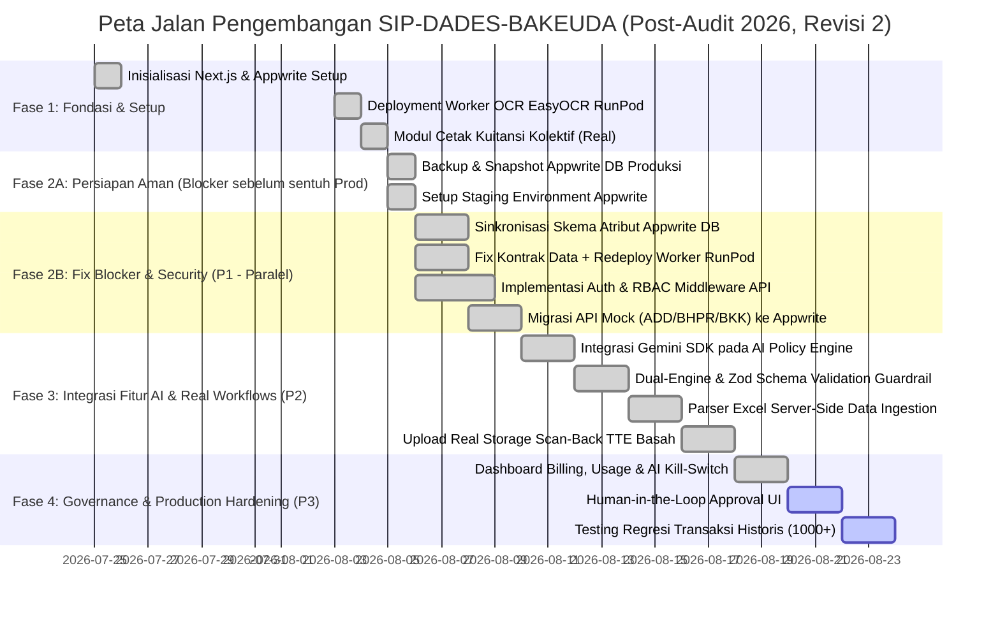
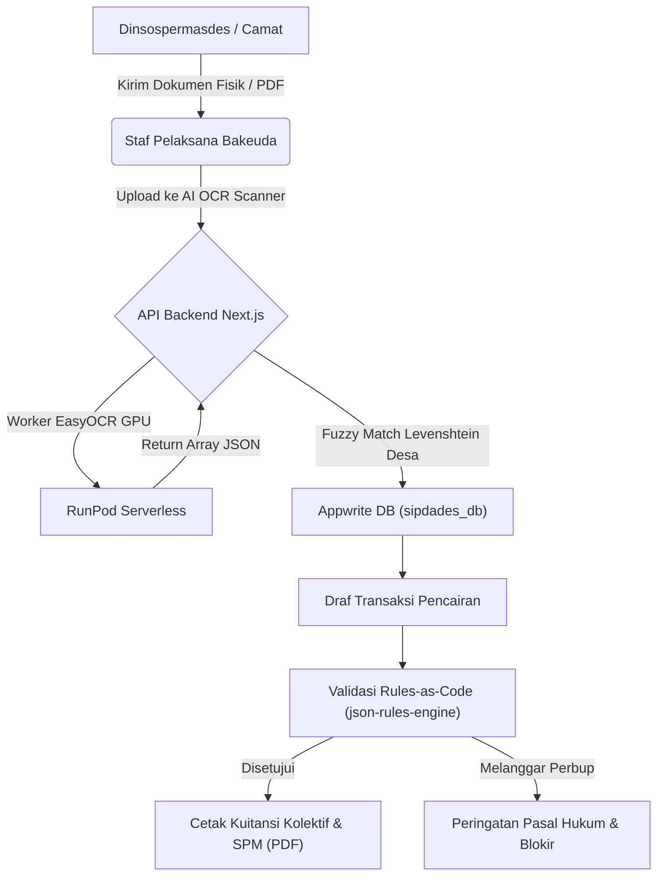

# ROADMAP: SIP-DADES-BAKEUDA

Sistem Informasi Pengelolaan Dana Desa dan Bantuan Keuangan (SIP-DADES) Badan Keuangan Daerah (Bakeuda) Kabupaten Purbalingga TA 2026.
Proyek ini mengonversi proses manual Excel (`ADD-2026.xls` & `BKK 2026.xlsm`) menjadi aplikasi web terpadu dengan integrasi AI (OCR & Rules-as-Code Governance Engine).

> **Diperbarui:** 5 Agustus 2026 (Revisi ke-2)
> **Dasar Pembaruan:** Konsolidasi Laporan Audit Menyeluruh (`storage/reports/Laporan_Audit_Menyeluruh_SIP-DADES-BAKEUDA.md`) + review kesiapan eksekusi agent
> **Perubahan dari versi sebelumnya:** menambahkan langkah backup/staging sebelum ubah skema produksi, memparalelkan Auth/RBAC dengan perbaikan fondasi (bukan menunggu di akhir Fase 2), menambahkan kriteria "Definition of Done" per task, menambahkan langkah redeploy eksplisit untuk worker RunPod, dan merevisi estimasi waktu agar lebih realistis.

---

## 📅 Milestone Proyek

---

## 🎯 Prioritas Pengembangan (Post-Audit 5 Agustus 2026, Revisi 2)

### 🟣 Prioritas 0 — Prasyarat Keselamatan Data (WAJIB sebelum menyentuh apa pun di Prod)

1. **Backup & Snapshot Appwrite DB Produksi**
   - Ekspor seluruh koleksi `sipdades_db` (`master_desa`, `pagu_alokasi`, `transaksi_pencairan`, dll.) ke snapshot yang bisa direstore.
   - **Definition of Done:** snapshot tersimpan di lokasi terpisah (bukan di server yang sama), dan ada 1 kali uji restore berhasil ke environment terpisah.

2. **Setup Staging Environment**
   - Duplikasi project Appwrite (atau minimal database) untuk staging, terpisah dari produksi.
   - **Definition of Done:** semua task di Fase 2B dikerjakan & diverifikasi dulu di staging sebelum di-merge ke produksi.

> ⚠️ **Catatan:** Task di Fase 2B tidak boleh mulai sebelum kedua item di atas selesai. Mengubah skema produksi tanpa backup adalah risiko kehilangan data transaksi keuangan riil.

---

### 🔴 Prioritas 1 — Perbaikan Fondasi & Keamanan Inti (Dikerjakan Paralel, bukan Sekuensial)

> **Perubahan penting:** Auth/RBAC dipindah agar berjalan **paralel** dengan perbaikan skema & OCR — bukan menunggu di akhir seperti versi sebelumnya. Ini satu-satunya item berstatus risiko keamanan *aktif*, jadi tidak boleh jadi antrean terakhir.

1. **Sinkronisasi Skema Appwrite (Schema Drift Fix)**
   - Menyelaraskan nama atribut di `scripts/setup-appwrite-add.ts`, dokumen skema (`docs/schemas/unified_database_schema.md`), dan seluruh API handler: `status_verifikasi`, `nominal_pencairan_net`, `desa_id`.
   - **Definition of Done:**
     - [ ] Daftar lengkap semua file yang mereferensikan ketiga atribut ini disusun dulu (grep seluruh repo, bukan cuma yang disebut audit).
     - [ ] Setiap file diupdate ke nama atribut yang disepakati (final: `status_verifikasi`, `nominal_pencairan_net`, `desa_id`).
     - [ ] Test end-to-end: buat transaksi baru via `/api/transactions` → cek muncul benar di `/api/kuitansi` → cek muncul benar di `/api/add/rekap-spm`.
     - [ ] Diverifikasi di staging dulu, baru merge ke produksi.

2. **Fix Kontrak Data OCR + Redeploy Worker RunPod**
   - Update `runpod-ocr-worker/handler.py` agar output sesuai skema yang diharapkan `/api/ocr/route.ts` (array `data`, `metadata_sumber_dana`, `metadata_no_surat`).
   - **Definition of Done:**
     - [ ] `handler.py` diupdate dan diuji lokal dengan sample dokumen.
     - [ ] **Worker di-redeploy ke RunPod** (bukan cuma commit ke repo — worker berjalan sebagai endpoint terpisah, jadi perubahan kode tidak otomatis aktif tanpa redeploy).
     - [ ] Uji end-to-end: upload dokumen scan asli → OCR jalan → data ter-parse benar di `/api/ocr` → tidak ada error `Format data dari AI tidak valid`.

3. **Implementasi Auth & RBAC Middleware API**
   - Memasang autentikasi session/token Appwrite dan pengecekan role pada seluruh endpoint `/api/*`.
   - **Definition of Done:**
     - [ ] Middleware auth terpasang di semua route `/api/*` tanpa kecuali (buat checklist eksplisit per endpoint agar tidak ada yang terlewat).
     - [ ] Matriks role dari `docs/workflows/UX_RBAC_Plan.md` diimplementasikan (5 role: Super Admin, Staf Desa, Verifikator Kecamatan, Dinsospermasdes, Bakeuda).
     - [ ] Uji negatif: request tanpa token → harus ditolak (401/403), bukan cuma uji jalur "berhasil".

4. **Migrasi Endpoint API Mock ke Live Appwrite**
   - Mengganti data buatan statis pada `/api/add`, `/api/bhpr`, `/api/bkk`, `/api/regulasi` dengan kueri Appwrite sungguhan.
   - **Definition of Done:**
     - [ ] Tidak ada lagi `sampleAddTransactions`/`sampleBhprTransactions`/`sampleBkkTransactions` tersisa di kode.
     - [ ] `POST` di masing-masing endpoint benar-benar menulis ke koleksi Appwrite terkait (diverifikasi manual di Appwrite console).
     - [ ] Bergantung pada task #1 selesai lebih dulu (nama atribut sudah final).

---

### 🟡 Prioritas 2 — Aktivasi Fitur AI & Alur Kerja Real

1. **AI Policy Compiler Real (Rules-as-Code)**
   - Memasang SDK `@google/generative-ai` pada `/api/regulasi/extract-rules` untuk mengekstrak Perbup PDF menjadi JSON Logic/AST secara dinamis.
   - **Definition of Done:** minimal 3 dokumen Perbup historis diuji ekstraksi, hasil dibandingkan manual dengan angka yang benar (uji akurasi sebelum dianggap selesai).
   - **Prasyarat:** API key Gemini/OpenAI dikonfigurasi via environment variable (bukan hardcode), dan biaya per-panggilan sudah diestimasi (lihat Prioritas 3 #1).

2. **Dual-Engine & Zod Schema Guardrail**
   - Menerapkan validasi skema ketat untuk mencegah halusinasi desimal persentase finansial (ADDM 70%, BHPR 20%, PBB 100%).
   - **Definition of Done:** ada test case yang sengaja menyuntikkan input ambigu untuk memastikan sistem menolak/menandai, bukan meloloskan angka mencurigakan.
   - **Catatan:** fitur ini adalah **prasyarat**, bukan pelengkap opsional, dari task #1 di atas — jangan aktifkan AI Policy Compiler untuk keputusan finansial nyata sebelum guardrail ini jalan.

3. **Server-Side Excel Ingestion Parser**
   - Mengaktifkan pemrosesan file Excel sungguhan di `/admin/data-ingestion` menggunakan logika parser `import-bpjs`.
   - **Definition of Done:** upload file dengan baris sengaja error (nilai ADDM < 70%, desa hilang dari 224) → sistem menandai error dengan benar, bukan cuma jalur "semua valid".

4. **Alur Real Storage Scan-Back TTE Basah**
   - Mengganti simulasi `setTimeout` di `PrintScanWorkflow.tsx` dengan pengunggahan file fisik hasil scan ke Appwrite Storage bucket + verifikasi status otomatis.
   - **Definition of Done:** file benar-benar tersimpan di Storage bucket (bisa diunduh ulang), status transaksi berubah `MENUNGGU_TTE` → `CAIR` otomatis setelah upload.

---

### 🔵 Prioritas 3 — Governance, Monitoring & Production Readiness

1. **Dashboard Billing & AI Kill-Switch**
   - Membangun pemantauan biaya komputasi AI OCR/RunPod + batas anggaran otomatis (*kill-switch*) pada `/admin/billing`.
   - **Definition of Done:** kill-switch diuji nyata (matikan API AI secara manual dan pastikan fallback ke input manual berjalan, bukan sistem crash).

2. **Human-in-the-Loop (HitL) Approval UI**
   - Memastikan setiap draf regulasi yang diekstrak AI wajib diverifikasi dan disetujui oleh Kabid / Super Admin sebelum diaktifkan ke mesin validasi.
   - **Definition of Done:** tidak ada jalur teknis yang memungkinkan aturan baru aktif tanpa approval eksplisit (diuji dengan mencoba bypass).

3. **Automated Regression Testing**
   - Menjalankan pengujian regresi terhadap 1.000+ data transaksi historis untuk memastikan perubahan parameter regulasi tidak memicu defisit Siltap perangkat desa.
   - **Definition of Done:** test suite ini masuk ke pipeline CI/CD, berjalan otomatis setiap kali `master_regulasi` diubah — bukan pengujian manual sesekali.

---

## 🏢 Alur Bisnis Utama & Arsitektur System

---

## 📌 Status Modul Sistem

| Modul System | Status Saat Ini | Target Milestone Selanjutnya | Blocker/Prasyarat |
| :--- | :--- | :--- | :--- |
| **Cetak Kuitansi Kolektif (`/kuitansi`)** | 🟢 Production-Ready | Pertahankan sebagai benchmark modul lain | — |
| **Import BPJS (`/api/add/import-bpjs`)** | 🟢 Production-Ready | Integrasi live Appwrite DB & validasi NIK | — |
| **Database Appwrite (`sipdades_db`)** | 🟢 Terintegrasi & Sinkron | Sinkronisasi penuh skema staging-prod | — |
| **AI OCR Engine (`/api/ocr`)** | 🟢 Live & Resilient | Mendukung RunPod + Offline Local Server | — |
| **Auth/RBAC API** | 🟢 Live & Secure | Proteksi role verifikator kecamatan & desa | — |
| **TTE Scan-Back Workflow** | 🟢 Live & Live Storage | Koneksi riil ke Appwrite Storage Bucket | — |
| **Data Ingestion Excel (`/admin/data-ingestion`)** | 🟢 Live & Live Ingest | Mendukung format xls & xlsm secara live | — |
| **AI Policy Compiler (`/api/regulasi/extract-rules`)** | 🟢 Live & RAG-Enhanced | RAG `purbalingga_legal` + fallback luring | — |
| **API ADD, BHPR, BKK (`/api/add`, `/bhpr`, `/bkk`)** | 🟢 Live Appwrite DB | Pengujian regresi data transaksi riil | — |

---
*ROADMAP ini diperbarui secara berkala berdasarkan audit berkala dan integrasi fitur. Setiap task di atas harus memenuhi Definition of Done tercantum sebelum ditandai selesai — bukan sekadar "kode sudah ditulis".*
