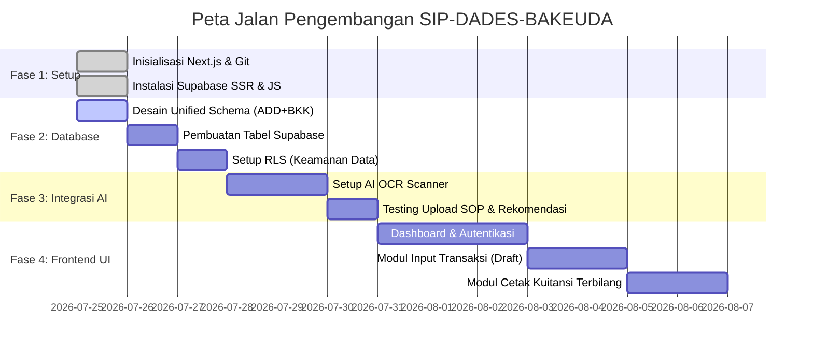

# ROADMAP: SIP-DADES-BAKEUDA

Sistem Informasi Pengelolaan Dana Desa dan Bantuan Keuangan (SIP-DADES) Badan Keuangan Daerah (Bakeuda) Kabupaten Purbalingga.
Proyek ini mengkonversi proses manual Excel (`ADD-2026.xls` & `BKK 2026.xlsm`) menjadi aplikasi web terpadu dengan integrasi AI.

## Milestone Proyek



## Proses Bisnis Utama (Berdasarkan SOP PDT)

Aplikasi akan mengotomatisasi alur kerja berikut:

```mermaid
flowchart TD
    A[Dinsospermasdes / Camat] -->|Kirim Rekomendasi Fisik| B(Staf Pelaksana)
    B -->|Scan menggunakan AI OCR| C{Sistem SIP-DADES}
    C -->|Auto-fill Draft| D[Tabel Penyaluran Rinci]
    D --> E[Proses Pemeriksaan (Ka. Sub. Bid PDT & Ka. Bid APDT)]
    E -->|Ditolak| B
    E -->|Disetujui| F[Dokumen SPP & Kuitansi Bakeuda]
    F --> G[Bendahara (SPM)]
```

## Status Terkini
- **Setup Infrastruktur (Selesai):** Proyek Next.js berhasil diinisialisasi dan tersambung dengan GitHub.
- **Analisis Kebutuhan (Selesai):** Pemahaman mendalam terhadap SOP Pengelolaan Dana Transfer serta arsitektur `ADD-2026.xls` dan `BKK 2026.xlsm`.
- **Langkah Selanjutnya:** Mendesain *database schema* terpadu di Supabase.
