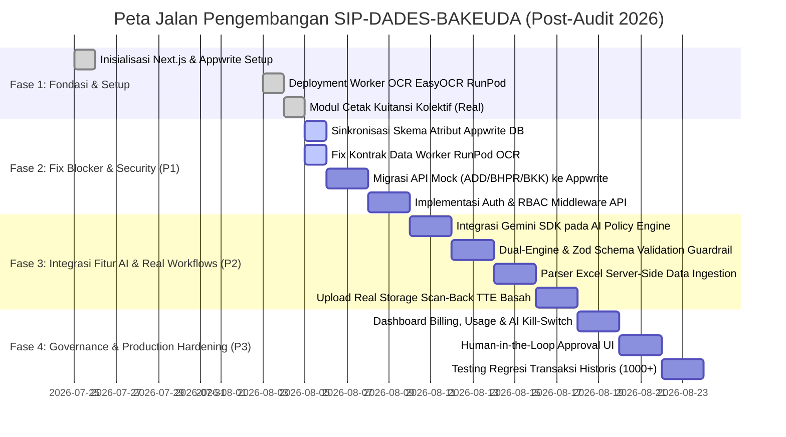
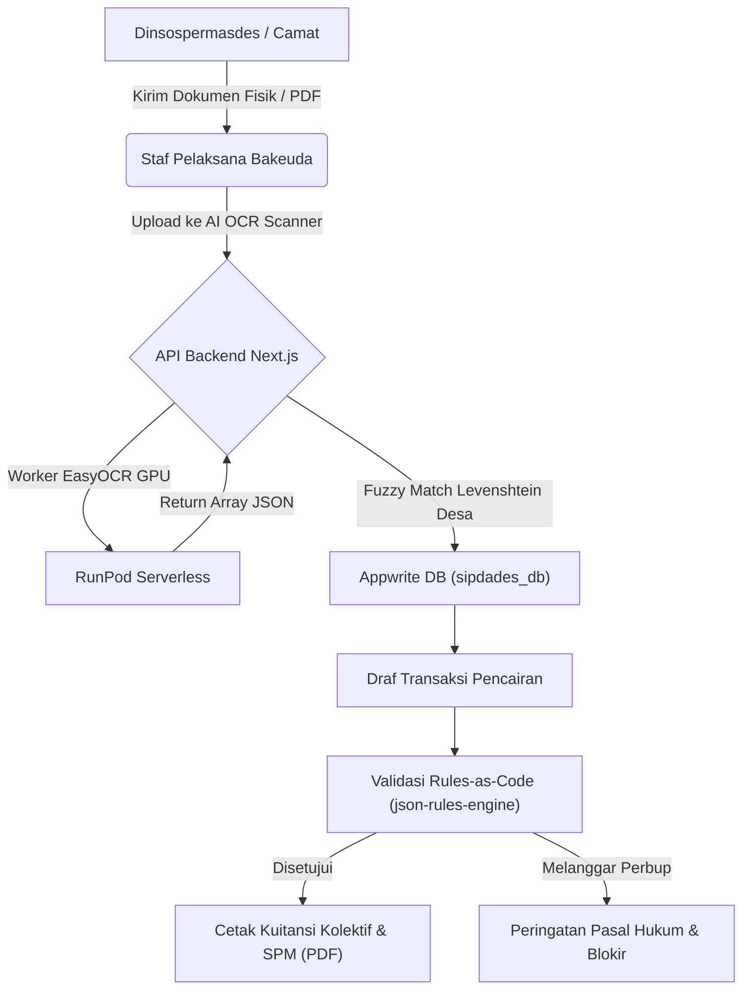

# ROADMAP: SIP-DADES-BAKEUDA

Sistem Informasi Pengelolaan Dana Desa dan Bantuan Keuangan (SIP-DADES) Badan Keuangan Daerah (Bakeuda) Kabupaten Purbalingga TA 2026.
Proyek ini mengonversi proses manual Excel (`ADD-2026.xls` & `BKK 2026.xlsm`) menjadi aplikasi web terpadu dengan integrasi AI (OCR & Rules-as-Code Governance Engine).

> **Diperbarui:** 5 Agustus 2026  
> **Dasar Pembaruan:** Konsolidasi Laporan Audit Menyeluruh (`storage/reports/Laporan_Audit_Menyeluruh_SIP-DADES-BAKEUDA.md`)

---

## 📅 Milestone Proyek

---

## 🎯 Prioritas Pengembangan (Post-Audit 5 Agustus 2026)

### 🔴 Prioritas 1 — Perbaikan Fondasi & Keamanan Inti (Blocker Produksi)
1. **Sinkronisasi Skema Appwrite (Schema Drift Fix):**
   * Menyelaraskan nama atribut di `scripts/setup-appwrite-add.ts`, dokumen skema, dan seluruh API handler: `status_verifikasi`, `nominal_pencairan_net`, dan `desa_id`.
2. **Perbaikan Kontrak Data Worker RunPod OCR:**
   * Memperbarui `runpod-ocr-worker/handler.py` agar mengembalikan struktur array `data` dan metadata surat (`metadata_sumber_dana`, `metadata_no_surat`) yang sesuai dengan spesifikasi Next.js `/api/ocr`.
3. **Migrasi Endpoint API Mock ke Live Appwrite:**
   * Mengganti data buatan statis pada `/api/add`, `/api/bhpr`, `/api/bkk`, dan `/api/regulasi` dengan kueri database Appwrite sungguhan.
4. **Implementasi Autentikasi & RBAC Middleware:**
   * Memasang autentikasi session/token Appwrite dan pengecekan role pada seluruh endpoint `/api/*` untuk mengamankan data transaksi pemerintah.

### 🟡 Prioritas 2 — Aktivasi Fitur AI & Alur Kerja Real
1. **AI Policy Compiler Real (Rules-as-Code):**
   * Memasang SDK `@google/generative-ai` pada `/api/regulasi/extract-rules` untuk mengekstrak Perbup PDF menjadi JSON Logic/AST secara dinamis.
2. **Dual-Engine & Zod Schema Guardrail:**
   * Menerapkan validasi skema ketat untuk mencegah halusinasi desimal persentase finansial (ADDM 70%, BHPR 20%, PBB 100%).
3. **Server-Side Excel Ingestion Parser:**
   * Mengaktifkan pemrosesan file Excel sungguhan di `/admin/data-ingestion` menggunakan logika parser `import-bpjs`.
4. **Alur Real Storage Scan-Back TTE Basah:**
   * Mengganti simulasi `setTimeout` di `PrintScanWorkflow.tsx` dengan pengunggahan file fisik hasil scan ke Appwrite Storage bucket + verifikasi status otomatis.

### 🔵 Prioritas 3 — Governance, Monitoring & Production Readiness
1. **Dashboard Billing & AI Kill-Switch:**
   * Membangun pemantauan biaya komputasi AI OCR/RunPod + batas anggaran otomatis (*kill-switch*) pada `/admin/billing`.
2. **Human-in-the-Loop (HitL) Approval UI:**
   * Memastikan setiap draf regulasi yang diekstrak AI wajib diverifikasi dan disetujui oleh Kabid APDT / Super Admin sebelum diaktifkan ke mesin validasi.
3. **Automated Regression Testing:**
   * Menjalankan pengujian regresi terhadap 1.000+ data transaksi historis untuk memastikan perubahan parameter regulasi tidak memicu defisit Siltap perangkat desa.

---

## 🏢 Alur Bisnis Utama & Arsitektur System

---

## 📌 Status Modul Sistem

| Modul System | Status Saat Ini | Target Milestone Selanjutnya |
| :--- | :--- | :--- |
| **Cetak Kuitansi Kolektif (`/kuitansi`)** | 🟢 Production-Ready | Pertahankan sebagai benchmark modul lain |
| **Import BPJS (`/api/add/import-bpjs`)** | 🟢 Functional | Tambahkan validasi kelengkapan NIK Perangkat |
| **Database Appwrite (`sipdades_db`)** | 🟡 Schema Drift Detected | Penyesuaian nama atribut (`status_verifikasi`, `nominal_pencairan_net`) |
| **AI OCR Engine (`/api/ocr`)** | 🟡 Contract Mismatch | Perbarui `handler.py` di RunPod worker repo |
| **TTE Scan-Back Workflow** | 🟡 UI Simulator | Hubungkan ke Appwrite Storage Bucket |
| **Data Ingestion Excel (`/admin/data-ingestion`)** | 🟡 UI Simulator | Implementasi server-side Excel parser |
| **AI Policy Compiler (`/api/regulasi/extract-rules`)** | 🔴 Mock Data | Integrasi SDK Gemini 2.0 Flash / OpenAI |
| **API ADD, BHPR, BKK (`/api/add`, `/bhpr`, `/bkk`)** | 🔴 Mock Data | Hubungkan kueri ke Appwrite Document DB |

---
*ROADMAP ini diperbarui secara berkala berdasarkan audit berkala dan integrasi fitur.*
