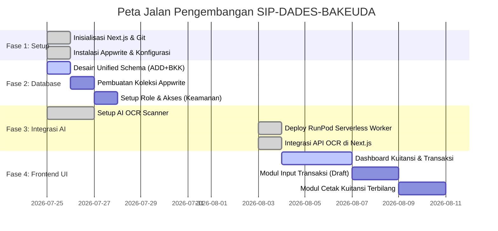
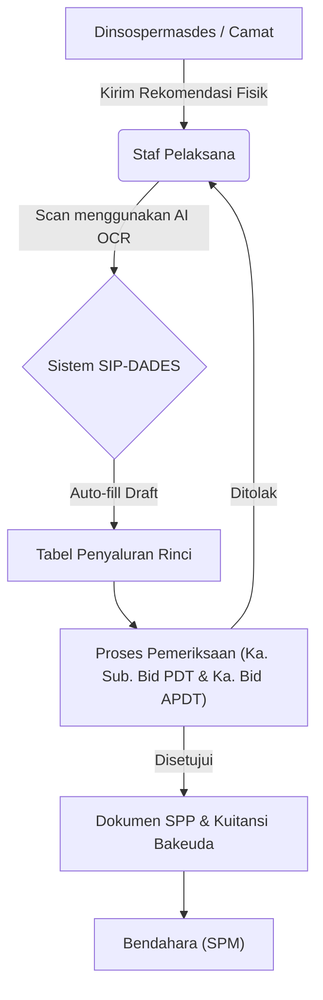

# ROADMAP: SIP-DADES-BAKEUDA

Sistem Informasi Pengelolaan Dana Desa dan Bantuan Keuangan (SIP-DADES) Badan Keuangan Daerah (Bakeuda) Kabupaten Purbalingga.
Proyek ini mengkonversi proses manual Excel (`ADD-2026.xls` & `BKK 2026.xlsm`) menjadi aplikasi web terpadu dengan integrasi AI.

## Milestone Proyek

## Proses Bisnis Utama (Berdasarkan SOP PDT)

Aplikasi akan mengotomatisasi alur kerja berikut:

## Arsitektur Infrastruktur & Efisiensi Biaya

Sebagai bentuk penghematan anggaran publik dan menjaga privasi data instansi, sistem memisahkan beban komputasi AI/OCR ke *Self-hosted Serverless GPU*:

1. **Frontend & Backend (Next.js)**: Menyajikan antarmuka pengguna dan memproses alur kerja dokumen.
2. **Database (Appwrite)**: Pusat penyimpanan data (Draft SPP, Kuitansi, Pagu Alokasi) dan sistem manajemen autentikasi / RLS keamanan.
3. **AI/OCR (RunPod Serverless)**: *Worker* Python mandiri berbasis GPU yang menggunakan **EasyOCR**. GPU ini berstatus *sleep* secara *default* dan hanya "bangun" saat ada permintaan *scan* dokumen rekomendasi dari staf Bakeuda, sehingga menekan biaya *compute* menjadi sekecil mungkin (*pay-per-second*). Dilengkapi dengan sistem persistent volume cache untuk mempercepat waktu *cold start*.

## Status Terkini
- **Setup Infrastruktur (Selesai):** Proyek Next.js berhasil diinisialisasi dan tersambung dengan Appwrite & GitHub.
- **Integrasi AI OCR (Selesai):** Pembuatan dan *deployment* OCR Engine (EasyOCR) ke RunPod Serverless GPU telah sukses. API OCR di Next.js telah dihubungkan dan sudah melalui proses *timeout tuning*.
- **Langkah Selanjutnya:** Melanjutkan pengembangan Frontend UI untuk *Dashboard Kuitansi* dan manajemen data dari Appwrite.
