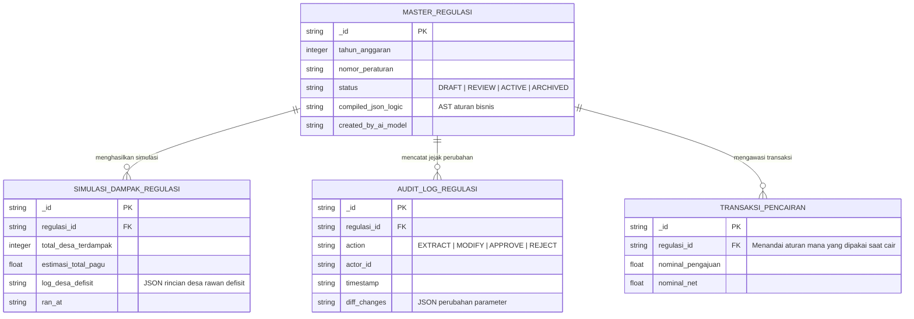
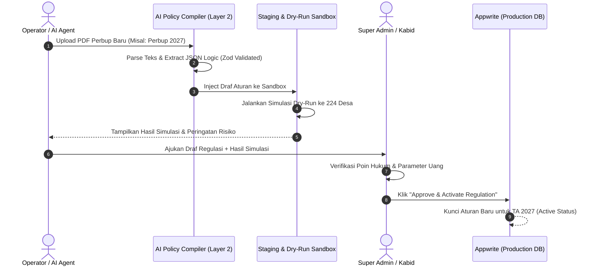

# Analisis Risiko & kelayakan Arsitektur AI-Native Governance Engine
**Sistem Informasi Pengelolaan Dana Desa dan Bantuan Keuangan (SIP-DADES) BAKEUDA**

Dokumen ini membedah secara teknis tantangan, mitigasi risiko, penyesuaian ERD, infrastruktur, workflow, dan RBAC yang timbul akibat penerapan arsitektur **AI-Native Governance / Rules-as-Code (RaC)**.

---

## 1. Potensi Tantangan & Risiko Utama (Risk Analysis)

Penerapan AI untuk mengawasi transaksi keuangan negara berbasis regulasi daerah membawa 4 tantangan kritis:

### A. Ambuitas Teks Hukum (Legal Ambiguity & Discretion Risk)
* **Masalah:** Teks Perbup sering mengandung klausa kualitatif atau diskresi pejabat. Contoh: *"Pencairan dapat diberikan lebih dari 1/12 pagu dalam hal terjadi bencana alam atau kondisi darurat mendesak."*
* **Tantangan AI:** AI tidak bisa secara mandiri menentukan apakah suatu kondisi di sebuah desa sudah sah masuk kategori "Darurat Bencana" tanpa surat keputusan resmi.
* **Mitigasi:** AI menyusun klausa ini sebagai **Conditional Override Flag** yang membutuhkan bukti dokumen lampiran SK Bencana.

### B. Risiko Halusinasi Desimal (Critical Calculation Drift)
* **Masalah:** Kesalahan 1 titik desimal oleh LLM (misal: mengekstrak 70% menjadi 7% atau 0.07 menjadi 0.7) dapat mengakibatkan kesalahan penyaluran dana sebesar miliaran rupiah.
* **Mitigasi:** **Strict JSON Schema Validation (Zod)** + *Dual-Engine Verification* (Mengekstrak aturan menggunakan 2 model AI terpisah, misal Gemini & Claude, lalu mencocokkan angkanya secara deterministik).

### C. Akuntabilitas Hukum & Auditabilitas (Audit Trail & Legal Liability)
* **Masalah:** Badan Pemeriksa Keuangan (BPK) atau Inspektorat tidak akan menerima argumen *"AI salah menghitung"*. Penanggung jawab hukum tetap Pejabat Publik (Bakeuda).
* **Mitigasi:** Prinsip **Human-in-the-Loop (HITL)**. AI bertindak sebagai *Drafting Assistant*, sedangkan eksekusi aktivasi aturan wajib ditandatangani secara digital oleh Super Admin / Kepala Bakeuda.

---

## 2. Penyesuaian Skema Database (ERD Extensions)

Untuk mendukung *versioning* regulasi, audit trail, dan simulasi dampak AI, skema database Appwrite perlu ditambahi 3 koleksi baru:

---

## 3. Workflow Lengkap: Siklus Hidup Regulasi (Policy Lifecycle)

Penerapan regulasi baru tidak terjadi secara langsung, melainkan melalui 5 tahap *safeguard*:

---

## 4. Penyesuaian Matriks Otorisasi (RBAC Engine)

Mengingat daya ubah *Rule Engine* ini sangat besar terhadap sistem keuangan, RBAC ditingkatkan dengan pemisahan wewenang ketat:

| Role | Izin Regulasi (Permissions) | Hak Akses Utama |
|---|---|---|
| **AI Agent (MCP Client)** | `Read` (PDF), `Create` (Draf JSON) | Membaca dokumen, ekstraksi parameter, dan merekomendasikan skema. **TIDAK BISA** mengaktifkan aturan di produksi. |
| **Operator Bakeuda (Maker)** | `Create` (Draf), `Execute` (Simulasi) | Mengunggah PDF regulasi, memicu ekstraksi AI, dan meninjau hasil *dry-run*. |
| **Verifikator Hukum (Checker)** | `Read`, `Update` (Koreksi Parameter) | Mengoreksi selisih angka desimal AI di Staging Area jika ada pasal yang salah tafsir. |
| **Super Admin / Kabid (Publisher)** | `Approve`, `Activate`, `Rollback` | Kunci tunggal aktivasi regulasi tahun berjalan. Berhak melakukan *Rollback* ke versi regulasi sebelumnya jika terjadi keadaan darurat. |

---

## 5. Kebutuhan Infrastruktur & Penghematan Compute (DevOps Architecture)

1. **Deterministic Rule Evaluator (Zero-LLM Cost on Runtime):**
   Meskipun kompilasi regulasi menggunakan LLM (Gemini/OpenAI), evaluasi transaksi harian **SAMA SEKALI TIDAK MEMANGGIL AI API**.
   Evaluasi transaksi menggunakan *Local Library* (`json-rules-engine` / Node.js native AST) yang berjalan di server web Next.js lokal (0 Rupiah biaya API per transaksi, Latency < 2ms).

2. **Deterministic Sandbox & Regression Test Suite:**
   Sebelum regulasi baru aktif, sistem secara otomatis menguji aturan baru tersebut terhadap 1.000+ data transaksi historis dari tahun sebelumnya untuk memverifikasi tidak ada *breaking change* atau logika crash pada rumus matematika.
