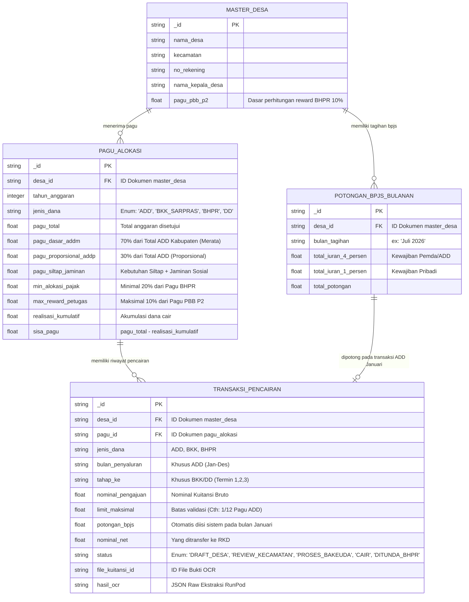

# Unified Database Schema (SIP-DADES-BAKEUDA)

Skema database terpadu ini menggabungkan struktur data berbasis dokumen (NoSQL) di **Appwrite**. Skema ini dirancang berdasarkan logika pencairan dan validasi finansial yang ketat sesuai regulasi:
1. **Perbup ADD No 1 Tahun 2026**: Validasi 1/12 pencairan bulanan, alokasi 70% (ADDM) & 30% (ADDP).
2. **SK Bupati BHPR No 5 Tahun 2026**: Validasi alokasi 20% (kegiatan pajak) & 10% (reward petugas).
3. **Surat Tagihan BPJS**: Potongan otomatis premi JKN-KIS (1% Pribadi, 4% Pemda) setiap Januari.

Karena berbasis dokumen, relasi antar tabel (Foreign Key) disimulasikan dengan menyimpan ID referensi (string).

## ER Diagram (Mermaid)

## Validasi Bisnis di Level Aplikasi (API / Next.js)

Skema di atas dirancang untuk mengakomodasi fungsi *backend* (API) yang akan melakukan validasi berikut secara otomatis:

1. **Validasi Plafon ADD Bulanan (Pasal 21 Perbup ADD 1/2026):**
   *   Saat staf desa mengajukan pencairan ADD bulanan, sistem akan mengecek apakah `nominal_pengajuan` melebihi `1/12 * pagu_total`. Jika melebihi, sistem akan menolak (kecuali ada flag darurat/tambahan yang diizinkan hingga 70% dari pagu Januari).
2. **Validasi Alokasi BHPR (Pasal 7 Perbup BHPR 5/2026):**
   *   Sistem akan melacak bahwa pengajuan BHPR harus memiliki rincian minimal 20% untuk kegiatan intensifikasi pajak. 
   *   Jika terdapat pengajuan `reward_petugas`, sistem akan memvalidasi agar tidak melebihi 10% dari `pagu_pbb_p2` yang ada di `MASTER_DESA`.
   *   Terdapat status `DITUNDA_BHPR` jika Bakeuda mendapati desa belum menyetorkan kewajiban pajaknya.
3. **Automasi Pemotongan BPJS:**
   *   Khusus pada transaksi ADD bulan **Januari**, sistem otomatis menarik nilai `total_potongan` dari koleksi `POTONGAN_BPJS_BULANAN` dan menguranginya dari `nominal_pengajuan` sehingga menghasilkan `nominal_net` yang akurat.

