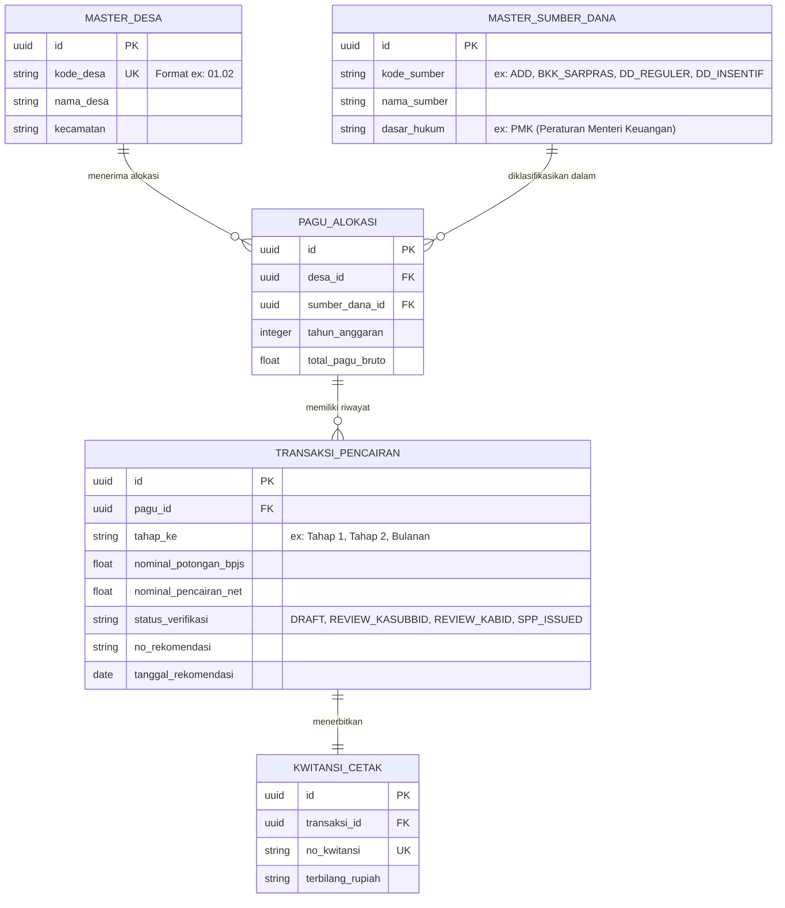

# Unified Database Schema (SIP-DADES-BAKEUDA)

Skema database terpadu ini menggabungkan struktur dari file `ADD-2026.xls` dan `BKK 2026.xlsm` untuk diimplementasikan di **Supabase**.

## ER Diagram (Mermaid)

## Deskripsi Tabel
1. **`master_desa`**: Tabel sentral untuk data geografis pemerintahan desa.
2. **`master_sumber_dana`**: Menyelesaikan masalah perbedaan file Excel (ADD vs BKK) menjadi satu tabel *lookup* terpadu.
3. **`pagu_alokasi`**: Tempat total anggaran tahunan dialokasikan per desa dan sumber dana.
4. **`transaksi_pencairan`**: Jantung dari aplikasi. Menggantikan *sheet* `Pengajuan`, `Tahap 1`, dan `Tahap 2`. Memiliki *workflow state* (`status_verifikasi`) sesuai SOP.
5. **`kwitansi_cetak`**: Tabel arsip untuk kuitansi yang telah diproses.
