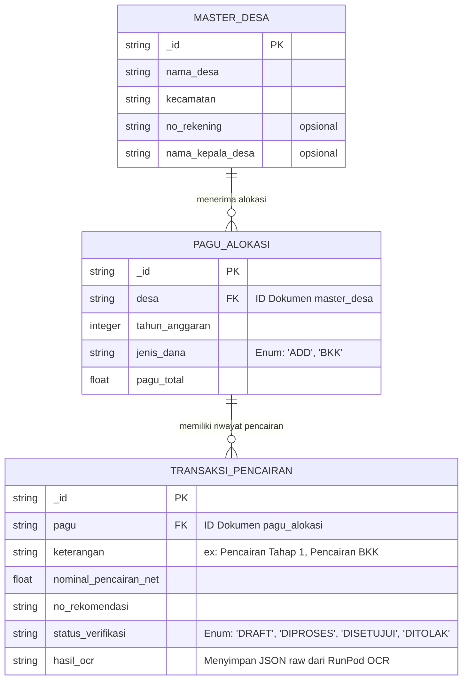

# Unified Database Schema (SIP-DADES-BAKEUDA)

Skema database terpadu ini menggabungkan struktur dari file `ADD-2026.xls` dan `BKK 2026.xlsm` untuk diimplementasikan di **Appwrite**. Berbeda dengan RDBMS tradisional, Appwrite merupakan sistem berbasis dokumen (NoSQL). Kita menggunakan simulasi *Foreign Key* dengan menyimpan ID string dokumen terkait.

## ER Diagram (Mermaid)

## Deskripsi Koleksi (Appwrite Collections)
1. **`master_desa`**: Koleksi referensi utama untuk data geografis dan rekening desa.
2. **`pagu_alokasi`**: Tempat total anggaran tahunan dialokasikan per desa. Menyelesaikan masalah pemisahan file Excel (ADD vs BKK) menjadi satu koleksi terpadu dengan atribut filter/flag `jenis_dana`.
3. **`transaksi_pencairan`**: Koleksi utama (*Jantung Aplikasi*). Menggantikan *sheet* `Pengajuan`, `Tahap 1`, dan `Tahap 2` di Excel. Menyimpan *workflow state* (`status_verifikasi`) sesuai SOP dan menampung hasil ekstrak otomatis OCR dari RunPod Serverless GPU.
