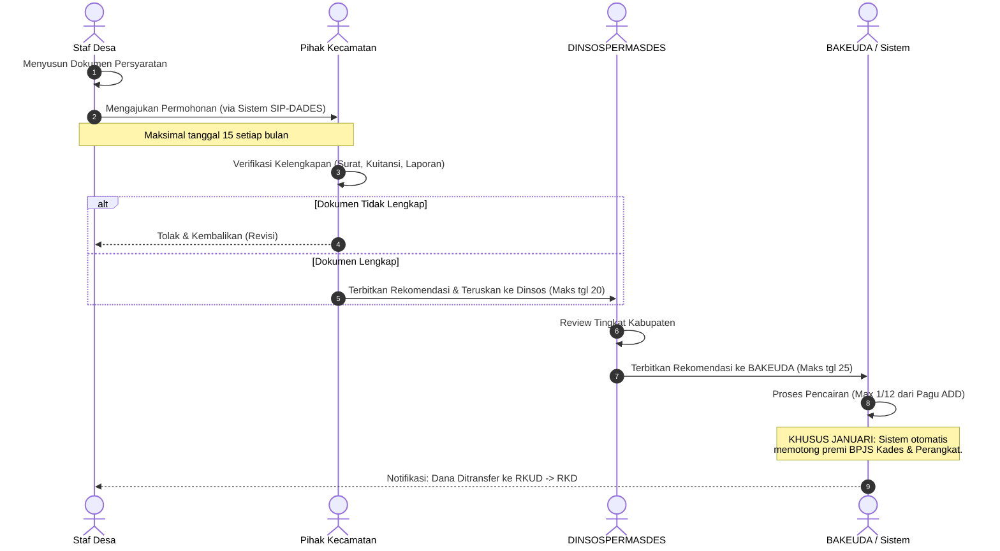

# SOP Workflow Pencairan Alokasi Dana Desa (ADD) Bulanan

**Tujuan:** Mengatur tata cara dan alur pencairan ADD secara rutin (setiap bulan) untuk membiayai penyelenggaraan pemerintahan desa dan penghasilan tetap (Siltap).
**Aktor yang Terlibat:** Staf Desa (Pemohon), Pihak Kecamatan (Camat/Verifikator), DINSOSPERMASDESP3A, BAKEUDA.

## 1. Persyaratan Dokumen (Upload ke Sistem)
Setiap bulan, Desa wajib mengunggah:
- **Januari:** Surat Pengantar, Perdes APBDesa, SPTJM, Kuitansi, Surat Kuasa Pemotongan BPJS Kesehatan.
- **Februari:** Surat Pengantar, Kuitansi bulan sebelumnya, Laporan Penggunaan ADD (Okt-Nov tahun lalu).
- **Maret - Des:** Surat Pengantar, Kuitansi bulan sebelumnya, Laporan Realisasi/Penggunaan ADD (2 bulan sebelumnya).

## 2. Alur Proses (Workflow)

## 3. Ketentuan Sistem SIP-DADES
- **Modul Kuitansi:** Sistem (OCR) akan membaca *field* nominal, tanda tangan, dan bulan dari Kuitansi yang diunggah.
- **State/Status Dokumen:** `DRAFT_DESA` ➔ `REVIEW_KECAMATAN` ➔ `REVIEW_DINSOS` ➔ `PROSES_BAKEUDA` ➔ `CAIR`.
