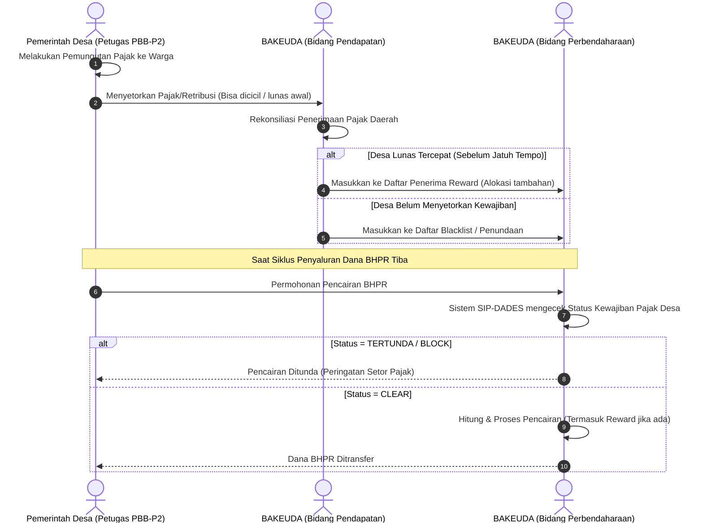

# SOP Workflow Bagi Hasil Pajak & Retribusi (BHPR) Tahunan

**Tujuan:** Mengatur tata cara pembagian dan optimalisasi Dana BHPR bagi pemerintah desa yang berkontribusi dalam pemungutan pajak (PBB-P2) dan retribusi daerah.
**Aktor yang Terlibat:** Pemerintah Desa (Kades, Petugas Pemungut PBB-P2), BAKEUDA (Bidang Pendapatan & Perbendaharaan).

## 1. Kebijakan Utama
- Desa wajib menganggarkan **minimal 20%** dari total BHPR untuk biaya operasional/intensifikasi pemungutan pajak (Sosialisasi, Transportasi).
- Terdapat **sistem Reward** (Penghargaan 10% dari pagu yang menjadi tanggung jawabnya) bagi Petugas Desa yang melakukan setoran lunas tercepat sebelum jatuh tempo.
- Terdapat **sistem Sanksi** (Penundaan pencairan BHPR) apabila kewajiban pajak desa tidak dipenuhi / tidak disetorkan.

## 2. Alur Proses (Workflow)

## 3. Ketentuan Sistem SIP-DADES
- **Integrasi Status:** SIP-DADES harus memiliki modul (bisa manual toggle atau API) yang menunjukkan status lunas/tidaknya kewajiban PBB-P2 suatu desa.
- **Blokir Sistem:** Jika status desa ditandai merah, sistem secara otomatis melarang (`disable`) tombol pengajuan pencairan dana BHPR.
