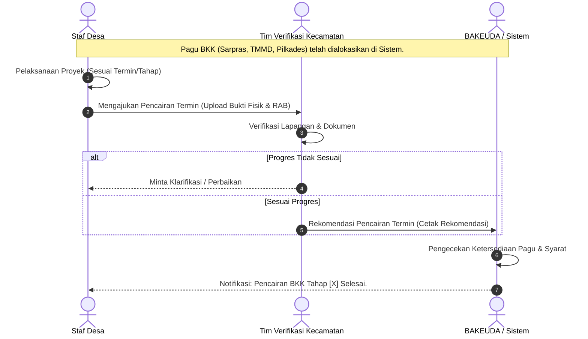

# SOP Workflow Bantuan Keuangan Khusus (BKK) Termin

**Tujuan:** Mengatur tata cara dan alur pencairan Bantuan Keuangan Khusus yang didasarkan pada termin/progres kegiatan (seperti Pembangunan Jalan, Balai Desa, TMMD, dll).
**Aktor yang Terlibat:** Staf Desa, Tim Verifikasi Kecamatan, Tim Inspeksi Kabupaten / BAKEUDA.

## 1. Persyaratan Dokumen (Upload ke Sistem)
Karena sifat pencairan bergantung pada jenis proyek fisik atau event (seperti Pilkades), pencairan dibagi menjadi termin pencairan:
- SK Penetapan BKK untuk Desa tersebut.
- Rencana Anggaran Biaya (RAB) / Desain.
- Laporan Progres Fisik (untuk termin ke-2 dan selanjutnya).
- Kuitansi pengajuan termin terkait.

## 2. Alur Proses (Workflow)

## 3. Ketentuan Sistem SIP-DADES
- **Modul Pagu:** Harus secara eksplisit menyebutkan kategori BKK (`jenis_dana`: BKK_SARPRAS, BKK_TMMD, BKK_PILKADES).
- **Modul Transaksi:** Dropdown pencairan tidak menggunakan 'Bulan', melainkan menggunakan 'Termin' atau 'Tahap' (contoh: Tahap 1 (50%), Tahap 2 (50%)).
